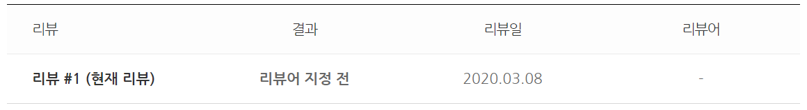
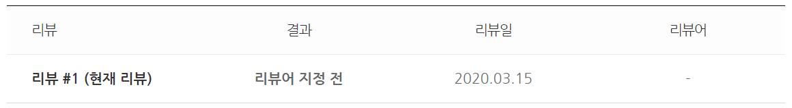
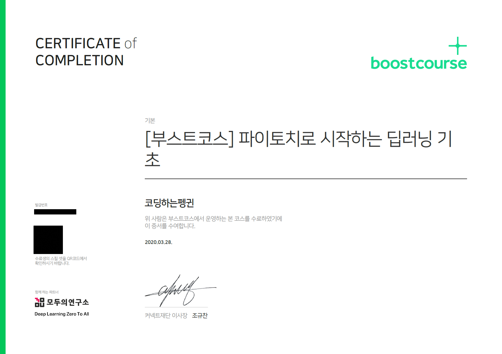

# 부스트코스 : 파이토치로 시작하는 딥러닝 기초

edwith에서 제공하는 [파이토치 부스트코스 강의](https://www.edwith.org/boostcourse-dl-pytorch)를 공부하고 정리한 문서입니다.

## Part 1. Machine Learning and Pytorch Basic

- [x] Lab-01-1 Tensor Manipulation 1
- [x] Lab-01-2 Tensor Manipulation 2
- [x] Lab-02 Linear regression
- [x] Lab-03 Deeper Look at GD
- [x] Lab-04-1 Multivariable Linear regression
- [x] Lab-04-2 Loading Data
- [x] Lab-05 Logistic Regression
- [x] Lab-06 Softmax Classification
- [x] Lab-07-1 Tips
- [x] Lab-07-2 MNIST Introduction

## Part 2. Neural Network

- [x] Lab-08-1 Perceptron
- [x] Lab-08-2 Multi Layer Perceptron
- [x] Lab-09-1 ReLU
- [x] Lab-09-2 Weight initialization
- [x] Lab-09-3 Dropout
- [x] Lab-09-4 Batch Normalization
- [x] Project A. Fashion MNIST Classifier

## Part 3. Convolutional Neural Network

- [x] Lab-10-0 Convolution Neural Network-intro
- [x] Lab-10-1 Convolution
- [x] Lab-10-2 Mnist CNN
- [x] Lab-10-3 visdom
- [x] Lab-10-4-1 ImageFolder1
- [x] Lab-10-4-2 ImageFolder2
- [x] Lab-10-5 Advance CNN(VGG)
- [x] Lab-10-6-1 Advanced CNN(RESNET-1)
- [x] Lab-10-6-2 Advanced CNN(RESNET-2)
- [x] Lab-10-7 Next step of CNN
- [x] Project B. Cat-Dog Classifier

## Part 4. Recurrent Neural Network

- [x] Lab-11-0 RNN intro
- [x] Lab-11-1 RNN basics
- [x] Lab-11-2 RNN hihello and charseq
- [x] Lab-11-3 Long sequence
- [x] Lab-11-4 RNN timeseries
- [x] Lab-11-5 RNN seq2seq
- [x] Lab-11-6 PackedSequence
- [x] Project C. Neural Weather Forecaster

## 🏅 Certification of Completion

